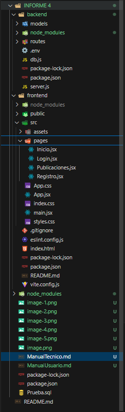
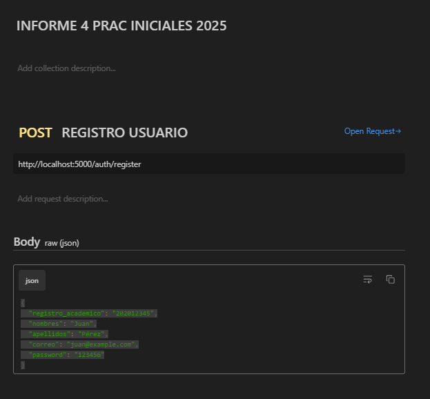
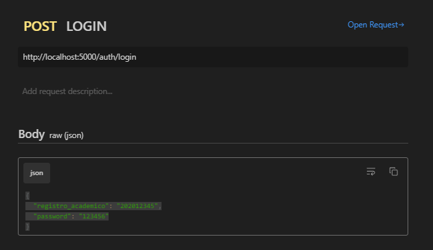
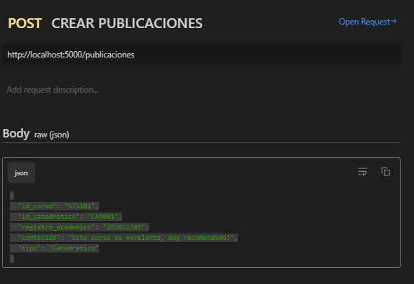
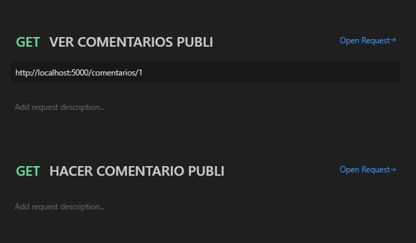
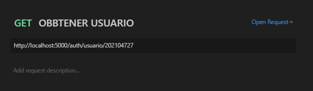

# Manual Técnico

## Introducción
Este documento describe la arquitectura, tecnologías y funcionamiento del servidor de la aplicación web para la evaluación de catedráticos en la Facultad de Ingeniería de la Universidad de San Carlos de Guatemala. 

## Arquitectura del Sistema
La aplicación sigue una arquitectura **Cliente-Servidor**, donde:
- **Cliente**: Implementado con **React.js**.
- **Servidor**: Implementado con **Node.js y Express**.
- **Base de Datos**: MySQL.

## Instalación y Configuración
### Requisitos
- **Node.js** versión 18 o superior.
- **MySQL** instalado y configurado.
- **Git** para gestionar el repositorio del código.

### Instalación del Servidor
1. Clonar el repositorio:
   ```sh
   git clone https://github.com/LuigiSuy/PRAINIC_LuigiSuy_202104727.git
   cd proyecto/server
   ```
2. Instalar dependencias:
   ```sh
   npm install
   ```
3. Configurar variables de entorno en un archivo `.env`:
   ```env
   PORT=3000
   DB_HOST=localhost
   DB_USER=root
   DB_PASSWORD=Luigisuy@363
   DB_NAME=CalificaiconCatedraticos 
   ```
4. Iniciar el servidor:
   ```sh
   npm start
   ```

## Estructura del Proyecto
```sh
/backend   
│── models/        # Definición de modelos de datos
│── routes/        # Definición de rutas
│── package.json   # Dependencias del proyecto
│── .env           # desarrollo de la aplicación
│── db.js
```



## API Endpoints
### Autenticación
- **POST /auth/register** → Registra un nuevo usuario.
- **POST /auth/login** → Inicia sesión y devuelve un token JWT




### Publicaciones
- **GET /posts** → Obtiene todas las publicaciones.
- **POST /posts** → Crea una nueva publicación.
- **GET /posts/:id** → Obtiene una publicación específica.




### Comentarios
- **POST /comments** → Agrega un comentario a una publicación.
- **GET /comments/:postId** → Obtiene comentarios de una publicación.



### Usuarios
- **GET /users/:id** → Obtiene información de un usuario.
- **PUT /users/:id** → Actualiza datos de un usuario.


## Base de Datos
### Estructura de Tablas
#### Tabla `usuarios`
```sql
CREATE Table Usuarios(
    registro_academico VARCHAR(20) PRIMARY KEY,
    nombre VARCHAR(100) NOT NULL,
    apellido VARCHAR(100) NOT NULL,
    correo VARCHAR(100) NOT NULL,
    contrasenia VARCHAR(100) NOT NULL
);
```

#### Tabla `cursos`
```sql
CREATE Table Cursos(
    codigo_curso VARCHAR(10) PRIMARY KEY,
    nombre_curso VARCHAR(100) NOT NULL,
    creditos INT NOT NULL
);
```

#### Tabla `Catedraticos`
```sql
CREATE Table Catedraticos(
    codigo_catedratico VARCHAR(10) PRIMARY KEY,
    nombre_completo VARCHAR(100) NOT NULL
);
```

#### Tabla `Curso_Catedratico`
```sql
CREATE Table Curso_catedratico(
    id_catedratico VARCHAR(10) NOT NULL,
    id_curso VARCHAR(10) NOT NULL,
    PRIMARY KEY (id_catedratico, id_curso),
    FOREIGN KEY (id_catedratico) REFERENCES Catedraticos(codigo_catedratico),
    FOREIGN KEY (id_curso) REFERENCES Cursos(codigo_curso)
);
```

#### Tabla `Cursos_aprobados`
```sql
CREATE Table Cursos_aprobados(
    registro_academico VARCHAR(20) NOT NULL,
    id_curso VARCHAR(10) NOT NULL,
    PRIMARY KEY (registro_academico, id_curso),
    FOREIGN KEY (registro_academico) REFERENCES Usuarios(registro_academico),
    FOREIGN KEY (id_curso) REFERENCES Cursos(codigo_curso)
);
```

#### Tabla `publicaciones`
```sql
CREATE Table Publicaciones(
    id_publicacion INT PRIMARY KEY AUTO_INCREMENT,
    id_curso VARCHAR(10) NOT NULL,
    id_catedratico VARCHAR(10) NOT NULL,
    registro_academico VARCHAR(20) NOT NULL,
    contenido TEXT NOT NULL,
    fecha_publicacion TIMESTAMP DEFAULT CURRENT_TIMESTAMP,
    tipo ENUM('Curso', 'Catedratico') NOT NULL,
    FOREIGN KEY (id_curso) REFERENCES Cursos(codigo_curso),
    FOREIGN KEY (id_catedratico) REFERENCES Catedraticos(codigo_catedratico),
    FOREIGN KEY (registro_academico) REFERENCES Usuarios(registro_academico)
);
```
#### Tabla `comentarios`
```sql
CREATE Table Comentarios(
    id_comentario INT PRIMARY KEY AUTO_INCREMENT,
    id_publicacion INT NOT NULL,
    registro_academico VARCHAR(20) NOT NULL,
    comentario TEXT NOT NULL,
    fecha_comentario TIMESTAMP DEFAULT CURRENT_TIMESTAMP,
    FOREIGN KEY (id_publicacion) REFERENCES Publicaciones(id_publicacion),
    FOREIGN KEY (registro_academico) REFERENCES Usuarios(registro_academico)
);
```

## Seguridad y Autenticación
- Se utiliza **JWT (JSON Web Token)** para la autenticación de usuarios.
- Las contraseñas se almacenan cifradas con **bcrypt**.
- Se implementan validaciones en las rutas para evitar acceso no autorizado.

## Despliegue
### Opción 1: Servidor Local
1. Configurar base de datos MySQL.
2. Iniciar el servidor con `npm start`.

### Opción 2: Servidor en la Nube (Ejemplo con Heroku)
1. Subir código al repositorio remoto (`git push origin main`).
2. Configurar base de datos remota en **ClearDB MySQL**.
3. Desplegar con:
   ```sh
   heroku create mi-aplicacion
   git push heroku main
   ```
---

**Fecha de Publicación:** 19/03/2025
