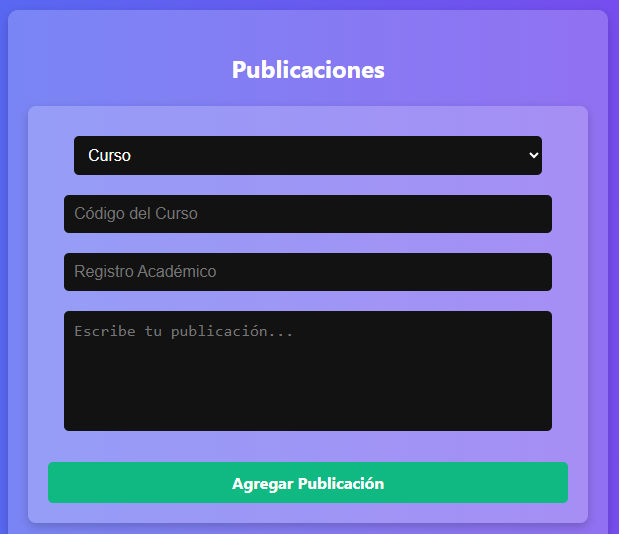

# Manual de Usuario

## Introducción
Bienvenido al Manual de Usuario de la aplicación web para la evaluación de catedráticos en la Facultad de Ingeniería de la Universidad de San Carlos de Guatemala. Este documento tiene como objetivo guiar a los usuarios en el uso correcto de la aplicación, describiendo sus funcionalidades y cómo interactuar con ellas.

## Requisitos
Para utilizar la aplicación, necesitas:
- Un dispositivo con acceso a internet (PC, laptop, tablet o smartphone).
- Un navegador web actualizado (Google Chrome, Mozilla Firefox, Microsoft Edge, etc.).
- Una cuenta de usuario registrada en la aplicación.

## Acceso a la Aplicación

### Iniciar Sesión
1. Abre el navegador y dirígete a la URL de la aplicación.
2. Ingresa tu **Registro Académico** y **Contraseña**.
3. Presiona el botón **Iniciar Sesión**.
4. Si las credenciales son correctas, accederás a la pantalla principal.

### Registrar un Usuario
1. En la pantalla de inicio de sesión, haz clic en **Registrarse**.
2. Completa los siguientes datos:
   - Registro Académico
   - Nombres
   - Apellidos
   - Correo Electrónico
   - Contraseña
3. Haz clic en **Registrar**.
4. Recibirás un correo de confirmación para activar tu cuenta.

## Funcionalidades
### Pantalla Principal
- Se muestran las publicaciones sobre catedráticos y cursos.
- Se pueden aplicar filtros para búsqueda:
  - **Por Curso**
  - **Por Catedrático**
  - **Por Nombre de Curso**
  - **Por Nombre de Catedrático**

### Crear una Publicación
1. Haz clic en **Nueva Publicación**.
2. Selecciona si la publicación es sobre un **Catedrático** o un **Curso**.
3. Escribe tu comentario y presiona **Publicar**.

### Comentar Publicaciones
1. Abre una publicación.
2. Escribe tu comentario en la caja de texto.
3. Presiona **Comentar**.

## Soporte Técnico
Si encuentras algún problema con la aplicación, contacta al equipo de desarrollo a través del correo 3022142670101@ingenieria.usac.edu.gt

---

**Fecha de Publicación:** 19/03/2025